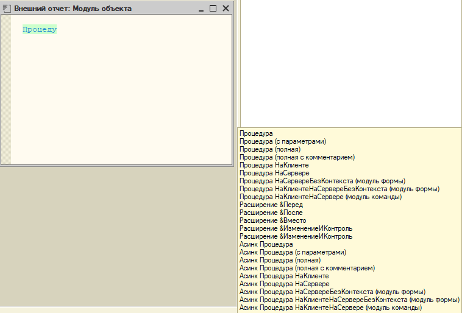

# OnesTemplates: шаблоны кода для конфигуратора 1С

[](https://t.me/st1c8)
[](https://github.com/stasganiev/OnesTemplates/issues)
[](https://github.com/stasganiev/OnesTemplates/releases/latest)

> **In English.** OnesTemplates is a set of text templates (snippets) for 1C Designer, the IDE of 1C:Enterprise 8.3. Type a short trigger such as `Proc` or `Query=`, press Space or Enter, and 1C Designer inserts a ready block of code. The file `GanievPRO.st` holds 318 templates for the English syntax of the 1C language and 394 for the Russian one. The rest of this page is in Russian.

Набираешь в модуле несколько букв, нажимаешь пробел или Enter, и конфигуратор подставляет готовый фрагмент кода. В файле `GanievPRO.st` 394 шаблона для русского синтаксиса и 318 для английского: от `Если` и `Процедура` до транзакции с обработкой исключения и запроса с обходом выборки.

## Как это выглядит

Набрал `Транз`, нажал пробел. Курсор стоит внутри попытки:

```bsl
НачатьТранзакцию();

Попытка
	
	
	
	ЗафиксироватьТранзакцию();
	
Исключение
	
	ОтменитьТранзакцию();
	ЗаписьЖурналаРегистрации(НСтр("ru = 'Выполнение операции'"),
		УровеньЖурналаРегистрации.Ошибка,,,
		ПодробноеПредставлениеОшибки(ИнформацияОбОшибке()));
	
КонецПопытки;
```

Набрал `Запрос=` и выбрал вариант «Запрос с конструктором с обработкой результата». Конфигуратор открывает конструктор запроса и вставляет его текст в кавычки:

```bsl
Запрос = Новый Запрос;
Запрос.Текст = 
"ВЫБРАТЬ ...";

Запрос.УстановитьПараметр("", );
РезультатЗапроса = Запрос.Выполнить();

Если РезультатЗапроса.Пустой() Тогда
	Возврат; //Продолжить|Прервать
КонецЕсли;

Выборка = РезультатЗапроса.Выбрать();
Пока Выборка.Следующий() Цикл
	
	
	
КонецЦикла;
```

Набрал `Проц`. На это сочетание приходится больше двадцати шаблонов, поэтому конфигуратор показывает список:

<div align="center">
  
</div>

Зачем это нужно:

- рутинный код набирается в разы быстрее;
- код у тебя и у коллег выглядит одинаково;
- заготовки сразу соответствуют стандартам разработки 1С, к ним меньше вопросов у SonarQube и EDT.

## Установка

> Эти действия выполняются один раз и действуют в конфигураторах всех информационных баз на твоём компьютере.

1. Открой файл [GanievPRO.st](./GanievPRO.st) и сохрани его в локальную папку кнопкой **Download raw file**.
2. Открой в конфигураторе менеджер шаблонов через меню **Сервис - Шаблоны текста** (Ctrl+Shift+T).
3. В подменю **Действия** или из контекстного меню перейди в **Настройку шаблонов**.
4. Отключи использование стандартных шаблонов.
5. Добавь новый используемый файл и выбери сохранённый файл *GanievPRO.st*. Нажми **ОК**.
6. Чтобы включить автоподстановку, перейди в конфигураторе в меню **Сервис - Параметры**.
7. На вкладке **Модули** в поле **Автозамена** выбери режим *Включить* или *Включить с подсказкой*. Нажми **ОК**.

[Подробная инструкция с картинками](./doc/installtutorial.md)

## Каталог шаблонов

[Полный каталог](./doc/catalog.md): 712 шаблонов по группам, у каждого указано сочетание для вызова.

Часть сочетания в квадратных скобках набирать не обязательно: для `Проц[едура]` хватит `Проц`.

## Что лежит в репозитории

| Файл | Что это |
| --- | --- |
| `GanievPRO.st` | Основной файл шаблонов. Подключать нужно его |
| `edt/comments` | 24 шаблона для EDT: комментарии `// @skip-check`, которые отключают проверку кода для строки |
| `doc/` | Инструкции и каталог шаблонов |
| `tools/make_catalog.py` | Скрипт, который собирает каталог из `GanievPRO.st` |
| `SSLDataExchange.st`, `MyTemlates.st` | Черновики автора. Подключать их не нужно |

## Как предложить идею или правку

- Нашёл ошибку или хочешь новый шаблон: заведи [issue](https://github.com/stasganiev/OnesTemplates/issues) или напиши в [Telegram-чат](https://t.me/st1c8).
- Хочешь внести правку сам: сделай fork, создай ветку от `dev` и пришли pull request. Порядок описан в [отдельной инструкции](./doc/gitflow.md).
- После правки шаблонов пересобери каталог: `python tools/make_catalog.py`.

## История и авторы

OnesTemplates продолжает труд Павла Чистова, который собрал самый полный и удобный набор шаблонов для конфигуратора 1С. С 01.08.2023 проект живёт в этом репозитории, его поддерживают авторы и сообщество.

| Имя | Страница | Telegram-канал |
| --- | --- | --- |
| Стас Ганиев | [GitHub](https://github.com/stasganiev) | [OneSCast](https://t.me/OneSCast) |
| Артур | [Портал программиста 1С](https://koder.by/shablony_avtozameny_1s.php) | [1Cnik](https://t.me/by_1cnik) |

## Лицензия

[MIT](./LICENSE)
