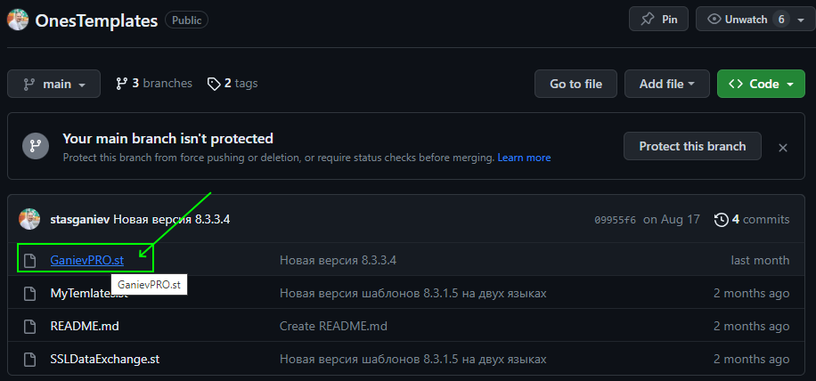
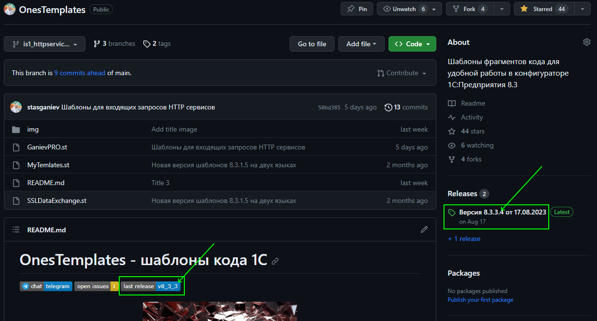
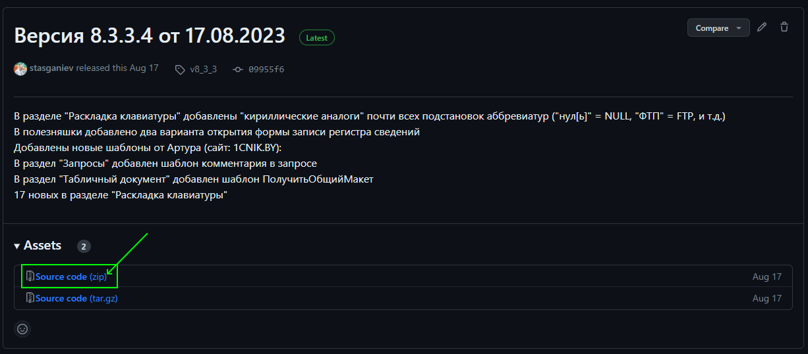

[Главная](./../README.md)

# Установка и подключение шаблонов

>Данные дейсвия выполняются один раз и действуют в конфигураторах всех информационных баз на вашем компьютере

## 1 Сохранение файла шаблонов в локальную папку на диске

>Процесс скачивания, подключения репозитория и работы с проектом по git-flow описан в [отдельной инструкции]("./gitflow.md").

Если у вас нет желания подключаться к разработке проекта на Github и скачивать к себе весь репозиторий, тогда для вас есть два способа скачать файл шаблона с [основной страницы](https://github.com/stasganiev/OnesTemplates) проекта:

### Способ 1

1. Открыть файл **GanievPRO.st** щелчком по его имени
2. Нажать кнопу *Download raw file* и указать папку для сохранения файла

  &nbsp;
  

### Способ 2

1. Перейти к описанию последней версии релиза проекта по ссылке справа, в разделе описания релизов, либо по ссылке в заголовке справки на главной странице
2. На странице описания версии щелкаем по ссылке *Source code (zip)* и скачиваем архив
3. Распаковываем содержимое архива в локальную папку, где лежат все ваши шаблоны

  &nbsp;
  

## Подключиение шаблонов в конфигураторе

2. Открой в конфигураторе мешеджер шаблонов через меню **Сервис - Шаблоны текста** (Ctrl+Shift+T)
3. В подменю **Действия** или из контекстного меню перейди в **Настройку шаблонов**
4. Отключи использование стандартных шаблонов
5. Добавь новый используемый файл и выбери сохраненный файл *GanievPRO.st*. Нажми **ОК**

## 

6. Для включения режима автоподстановки, перейди в конфигураторе в меню **Сервис - Параметры**
7. На вкладке **Модули** в поле **Автозамена** выбери режим *Включить* или *Включить с подсказкой*. Нажми **ОК**

[Назад](./../README.md)
