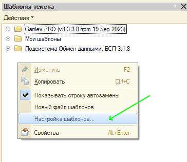
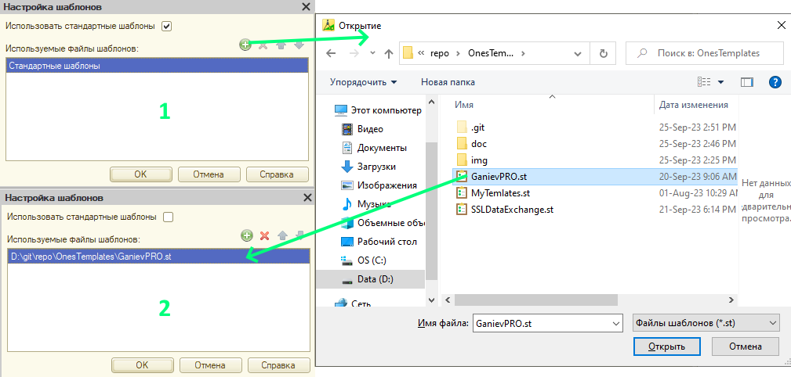
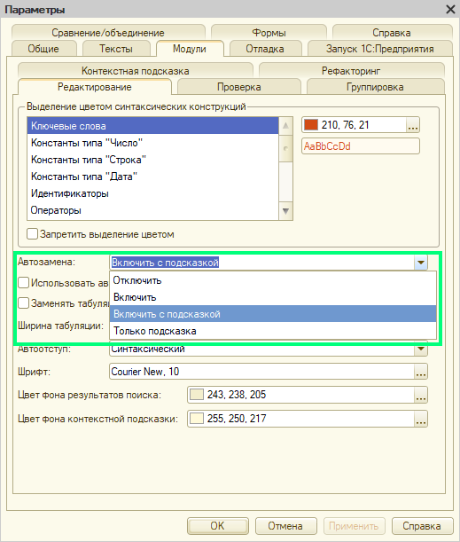
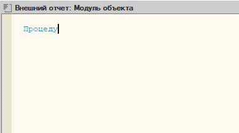
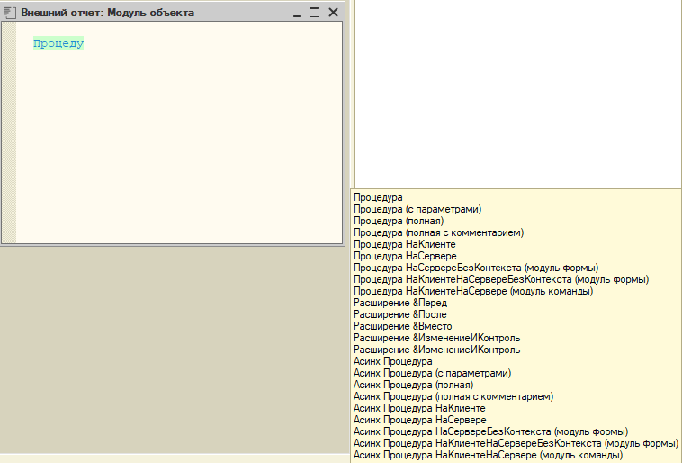

[Главная](./../README.md)

# Установка и подключение шаблонов

>Данные дейсвия выполняются один раз и действуют в конфигураторах всех информационных баз на вашем компьютере

## 1 Сохранение файла шаблонов в локальную папку на диске

>Процесс скачивания, подключения репозитория и работы с проектом по git-flow описан в [отдельной инструкции](./gitflow.md).

Если у вас нет желания подключаться к разработке проекта на Github и скачивать к себе весь репозиторий, тогда для вас есть два способа скачать файл шаблона с [основной страницы](https://github.com/stasganiev/OnesTemplates) проекта:

### Способ 1

1. Открыть файл **GanievPRO.st** щелчком по его имени
2. Нажать кнопу *Download raw file* и указать папку для сохранения файла

  &nbsp;
  

### Способ 2

1. Перейти к описанию последней версии релиза проекта по ссылке справа, в разделе описания релизов, либо по ссылке в заголовке справки на главной странице
2. На странице описания версии щелкаем по ссылке *Source code (zip)* и скачиваем архив
3. Распаковываем содержимое архива в локальную папку, где лежат все ваши шаблоны

  &nbsp;
  

## 2 Подключиение шаблонов в конфигураторе

1. Открыть в конфигураторе менеджер шаблонов через меню *Сервис - Шаблоны текста* (Ctrl+Shift+T)
2. В подменю *Действия* или из контекстного меню выбрать пункт *Настройка шаблонов*
3. Отключить использование стандартных шаблонов (снять флажок)
4. В список используемых файлов добавить новый файл и выбрать сохраненный файл *GanievPRO.st*
5. Нажать *ОК* для сохранения изменений

  &nbsp;
  

## 3 Включение режима автозамены в настройках конфигуратора

1. В конфигураторе перейти в меню *Сервис - Параметры*, вкладка *Модули*
2. В поле *Автозамена* выбрать режим *Включить* или *Включить с подсказкой*
3. Нажать *ОК* для сохранения изменений

  

Как работают разные режимы автозамены:

### Включить

При наборе шаблона или его существенной части (если известно, что это шаблон), для продолжения подстановки кода дополнения достаточно нажать пробел или клавишу *Enter*.

  

### Включить с подсказкой

При наборе шаблона, как только набрана его существенная часть, конфигуратор начинает подсвечивать подсказку с перечнем возможных вариантов для текущей последовательности символов. Для продолжения подстановки кода дополнения достаточно нажать пробел или клавишу *Enter*.

  

### Только подсказка

При наборе шаблона, также будет появлятся подсказка с возможными подстановками, но по факту автозамена работать не будет. Вариант применим, например, если вы редко пользуетесь шаблонами для больших фрагментов алгоритмов. Данная подсказко может напомнить о существовании шаблона, после чего можно будет мышкой перетащить код шаблона из списка шаблонов непосредственно в модуль.

---

[Назад](./../README.md)
